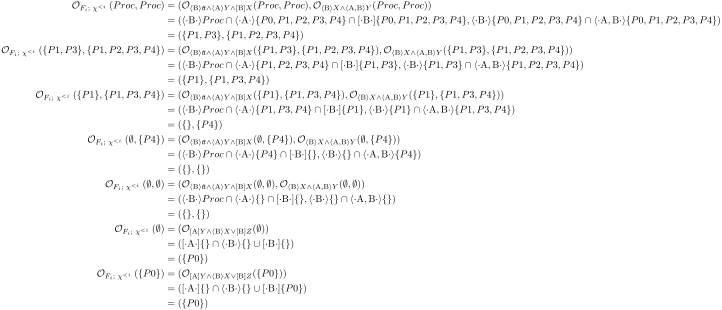

- [HML Solver and $\LaTeX$ Export](#org50c8fc8)
- [Usage](#orgbf07ec1)
  - [Define LTS](#orgf847b35)
  - [Defining System of Equations](#orgbb83cdb)
  - [Create n-nested recursive System](#org48457bf)
  - [Solve System on LTS](#org39496e6)


<a id="org50c8fc8"></a>

# HML Solver and $\LaTeX$ Export

This is a simple tool, which allows solving n-nested-recursive Systems on LTS and export the required calculations as $\LaTeX$ Code. The exported Script uses following macros to model HML-Fromula


<a id="orgbf07ec1"></a>

# Usage


<a id="orgf847b35"></a>

## Define LTS

Define Processlabels, Actions and Variables

```haskell
data Proc = P0|P1|P2|P3|P4 deriving (Eq, Ord, Show)
data Act = A|B                          deriving (Eq, Ord,Show)
data Variables = X|Y|Z                      deriving (Eq, Show, Ord)
```

Proc and Act need both instances of `Eq,Ord` since the Algorithm uses `Data.Set` to solve equations. The `Show` instance is used to render objects when producing a Formular. One might use custom `Show` instances instead to allow for pretty $LaTeX$ export. It's also possible to define the Processlabels as `data Proc = Proc String`, which would ease the implementation of pretty $\LaTeX$ printing, though this apporach is discouraged since it allows miskates like misspellings when defining HML Formulars. Same applies to `Act` and `Variables`.

The `Lib` Module exports definitions for `Transition p a` which model *T* part of an LTS. Using the function `ltsFromTrans :: Set (Transition p a) -> LTS p a` allows infering a whole LTS from a Set of Transitions.

```haskell
trans = fromList [
  Transition P1 A P0,
  Transition P1 B P3,
  Transition P3 A P0,
  Transition P4 B P1,
  Transition P1 A P2,
  Transition P2 B P2,
  Transition P3 B P3]

lts = ltsFromTrans trans
```


<a id="orgbb83cdb"></a>

## Defining System of Equations

Let's asume we want to solve a System of Equation like follows 

where we use the `act` record accessor to retrieve all Actions defined in our LTS. `Min` and `Max` are constructors for the `Fixpiont a` datatype.


<a id="org48457bf"></a>

## Create n-nested recursive System

The fucntion `makeSystem :: HML a v -> Declaration a v -> HMLEquation a v` will transform the declaration into a n-nested-recursive System if possible. When the declaration is malformed, this means it contains mutually recursive Variables of varied Fixpoint-Types the function will return `Nothing`.


<a id="org39496e6"></a>

## Solve System on LTS

At last you'd use the function `solveSystem :: LTS p a -> HMLEquation a v -> String` which solves the whole System and produces the $\LaTeX$ Code documenting the calculation steps as a String. The Result might look like this


